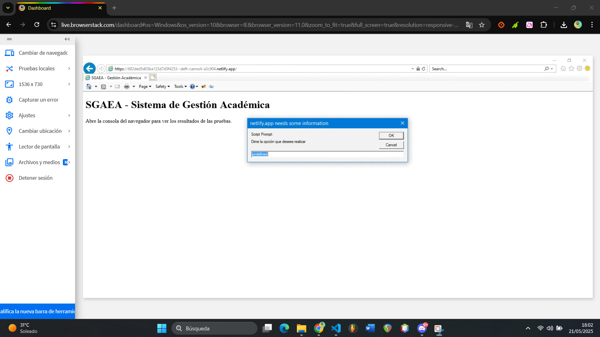
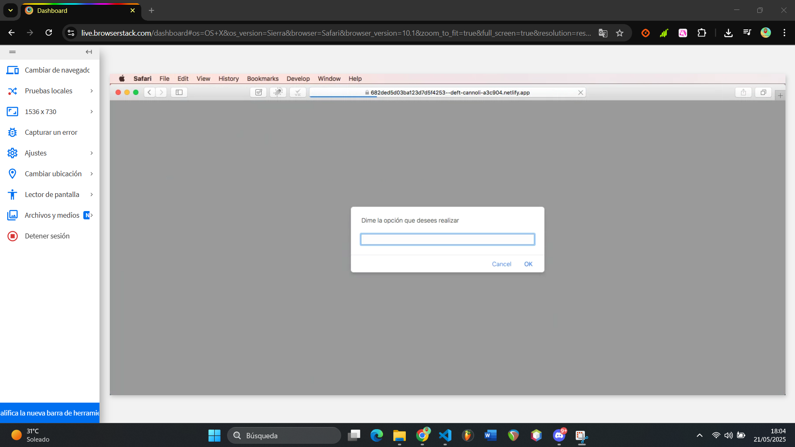

# 🎓 SGAEA – Sistema de Gestión Académica de Estudiantes y Asignaturas

Este proyecto es un sistema académico que permite gestionar estudiantes, asignaturas, matrículas y calificaciones. Está desarrollado en JavaScript moderno (ES6+) con clases, organizado en módulos, y se ejecuta en consola a través de `prompt()` en el navegador.

El objetivo del proyecto es asegurar que funcione también en navegadores antiguos, utilizando Babel y Webpack para transpilar y aplicar polyfills. Finalmente, se despliega el proyecto en **Netlify** y se prueba en BrowserStack.

---

## 📁 Estructura del proyecto

```
Task 4.2/
├── js/
│   ├── Asignatura.js
│   ├── Estudiante.js
│   └── SGAEA.js
├── tests/
│   └── pruebas.js
├── index.html
├── dist/                  # Carpeta generada por Webpack (build)
├── .babelrc
├── webpack.config.js
├── package.json
├── README.md              # Este documento
```

---

## ⚙️ 1. Configuración del entorno

### 1.1. Requisitos

- Node.js (https://nodejs.org)
- Git (https://git-scm.com)
- Navegador moderno

### 1.2. Inicializar el proyecto

```bash
npm init -y
```

### 1.3. Instalar dependencias

```bash
npm install --save-dev webpack webpack-cli webpack-dev-server
npm install --save-dev @babel/core babel-loader @babel/preset-env
npm install core-js regenerator-runtime
```

## 🛠️ 2. Configuración de Babel y Webpack

### `.babelrc`

```json
{
  "presets": [
    ["@babel/preset-env", {
      "useBuiltIns": "entry",
      "corejs": 3
    }]
  ]
}
```

### `webpack.config.js`

```js
const path = require("path");

module.exports = {
  entry: "./tests/pruebas.js",
  output: {
    filename: "bundle.js",
    path: path.resolve(__dirname, "dist"),
    clean: true
  },
  mode: "production",
  module: {
    rules: [
      {
        test: /\.js$/,
        exclude: /node_modules/,
        use: "babel-loader"
      },
      {
        test: /\.css$/i,
        use: ["style-loader", "css-loader"]
      }
    ]
  },
  devServer: {
    static: "./dist",
    open: true
  }
};
```

---

## 🧪 3. Scripts automatizados

En el archivo `package.json`:

```json
"scripts": {
  "start": "webpack serve --open",
  "build": "webpack --mode production"
}
```

Ejecutar:

```bash
npm run build     # Genera dist/bundle.js
npm run start     # Sirve el proyecto en http://localhost:8080/
```

---

## 🚀 4. Despliegue en Netlify

### 4.1. Crear cuenta

- Regístrate en https://netlify.com

### 4.2. Subir proyecto

- Desde la interfaz web de Netlify, selecciona "Add new site" > "Deploy manually".
- Arrastra la carpeta `dist/` generada por Webpack (con `index.html` y `bundle.js`).
- Espera a que se genere una URL pública.

### 🔗 URL generada de ejemplo

```
https://682ded5d03ba123d7d5f4253--deft-cannoli-a3c904.netlify.app/
```

Puedes compartir esta URL para probar la aplicación en línea.

---

## 🔍 5. Pruebas en BrowserStack

Se usó [BrowserStack](https://browserstack.com) para probar compatibilidad en navegadores antiguos:

| Navegador            | Sistema Operativo | Resultado |
|----------------------|-------------------|-----------|
| Internet Explorer 11 | Windows 10        | ✅ Funciona correctamente |
| Safari 10            | macOS Sierra      | ✅ Sin errores |

✅ Gracias a `@babel/preset-env` y `core-js`, el código ES6 se transpila a ES5 y funciona en navegadores obsoletos.

---
## 📷 Capturas de pantalla de su correcto funcionamiento
- Internet Explorer 11 en Windows 10

- Safari 10 en macOs Sierra

## 🧑‍💻 6. Funcionalidades del sistema

- Crear estudiantes y asignaturas.
- Matricular estudiantes.
- Registrar calificaciones.
- Calcular promedios.
- Buscar por nombre o ID.
- Reportes y listado general.

Todo se maneja a través de un menú por consola (`prompt()`).

## 🧹 Organización del repositorio

- `js/`: Lógica de clases principales.
- `tests/`: Pruebas y menú interactivo.
- `index.html`: Página base con llamada a `bundle.js`.
- `dist/`: Archivos finales para producción.
- `webpack.config.js`: Configuración de empaquetado.
- `.babelrc`: Configuración de transpiling.
- `README.md`: Documentación del proyecto.

---

## ✅ Conclusión

Este proyecto demuestra cómo desarrollar una aplicación modular moderna en JavaScript y prepararla para funcionar en entornos antiguos mediante herramientas profesionales como Babel, Webpack, y servicios de pruebas y despliegue como Netlify y BrowserStack.